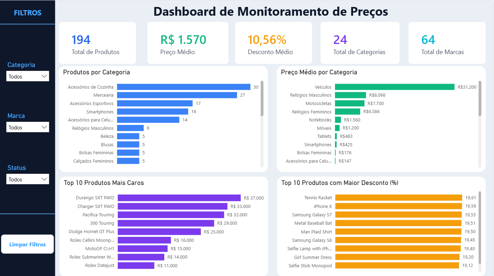

# Radar de Preços — Monitoramento de Preços e Estoque

Projeto de Engenharia e Análise de Dados que implementa um pipeline completo para coleta, tratamento, armazenamento e visualização de dados de produtos obtidos por meio da **DummyJSON API**, utilizando **Python, Pandas, PostgreSQL e Power BI**.

## Dashboard



---

# Sobre o Projeto

Este projeto foi desenvolvido com o objetivo de construir um pipeline completo de monitoramento de preços, contemplando todas as etapas do processo de dados: coleta via API, tratamento com Python e Pandas, armazenamento em PostgreSQL, criação de Views SQL para análise e desenvolvimento de um dashboard interativo no Power BI.

---

# Objetivos

- Consumir dados de uma API REST pública;
- Tratar e transformar dados brutos em informações analisáveis;
- Modelar e armazenar os dados em PostgreSQL;
- Criar Views SQL para alimentar análises e visualizações;
- Desenvolver um dashboard executivo para monitoramento de preços.

---

# Tecnologias Utilizadas

- Python
- Pandas
- Requests
- PostgreSQL
- SQLAlchemy
- Power BI
- Git
- GitHub

---

# Pipeline do Projeto

```text
DummyJSON API
       │
       ▼
 Python + Pandas
(Coleta e Tratamento)
       │
       ▼
 PostgreSQL
       │
       ▼
    Views SQL
       │
       ▼
    Power BI
       │
       ▼
 Dashboard
```

---

# Estrutura do Projeto

```text
monitoramento-precos/

├── dashboard/
│   ├── Dashboard_Monitoramento_Precos.pbix
│   └── dashboard_monitoramento_precos.png
│
├── scripts/
│   ├── coleta_dados.py
│   ├── criar_tabelas.py
│   ├── criar_views.py
│   └── conexao.py
│
├── sql/
│   ├── create_tables.sql
│   ├── vw_base_produtos.sql
│   ├── vw_historico_precos.sql
│   ├── vw_kpis.sql
│   ├── vw_posicionamento_categoria.sql
│   ├── vw_ranking_produtos.sql
│   └── vw_top10_maiores_descontos.sql
│
├── .env
├── .gitignore
├── requirements.txt
└── README.md
```

---

# Processo ETL

## Extract

Os dados são obtidos através da **DummyJSON API**, coletando informações como nome do produto, categoria, marca, preço, percentual de desconto, estoque e disponibilidade.

---

## Transform

Durante a etapa de transformação foram realizadas as seguintes operações:

- Seleção das colunas relevantes;
- Padronização dos nomes das colunas;
- Conversão dos tipos de dados;
- Tratamento de valores ausentes;
- Organização dos dados em tabelas normalizadas;
- Preparação dos dados para análise.

---

## Load

Após o tratamento, os dados são armazenados em um banco PostgreSQL utilizando SQLAlchemy, permitindo manter o histórico de preços e estoque dos produtos.

---

# Modelagem

| Tabela | Finalidade |
|---------|------------|
| **products** | Cadastro dos produtos |
| **price_history** | Histórico de preços e descontos |
| **stock_history** | Histórico de estoque e disponibilidade |

---

# Views SQL

| View | Finalidade |
|------|------------|
| **vw_base_produtos** | Consolidação das informações dos produtos |
| **vw_historico_precos** | Histórico de preços |
| **vw_kpis** | Indicadores gerais do dashboard |
| **vw_posicionamento_categoria** | Comparativo entre categorias |
| **vw_ranking_produtos** | Ranking de produtos por preço |
| **vw_top10_maiores_descontos** | Ranking dos produtos com maior desconto |

---

# Dashboard

O dashboard apresenta uma visão executiva do monitoramento de preços dos produtos.

## Indicadores

-  Total de Produtos
-  Preço Médio
-  Desconto Médio
-  Total de Categorias
-  Total de Marcas

---

## Visualizações

- Produtos por Categoria;
- Preço Médio por Categoria;
- Top 10 Produtos Mais Caros;
- Top 10 Produtos com Maior Desconto;
- Filtros por Categoria, Marca e Status.

---

# Principais Insights

- Identificação das categorias com maior quantidade de produtos cadastrados;
- Comparação do preço médio entre categorias;
- Ranking dos produtos de maior valor;
- Identificação dos produtos com os maiores descontos;
- Análise da distribuição de marcas e categorias.

---

# Autor

**Rafael Machado Rodrigues**

Estudante de Ciência da Computação com foco em Engenharia e Análise de Dados.

Projeto desenvolvido para fins de estudo, aprendizado e construção de portfólio.